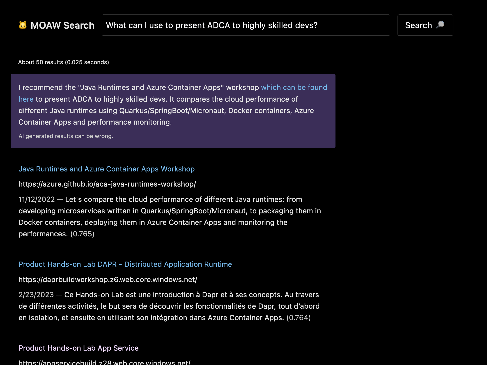
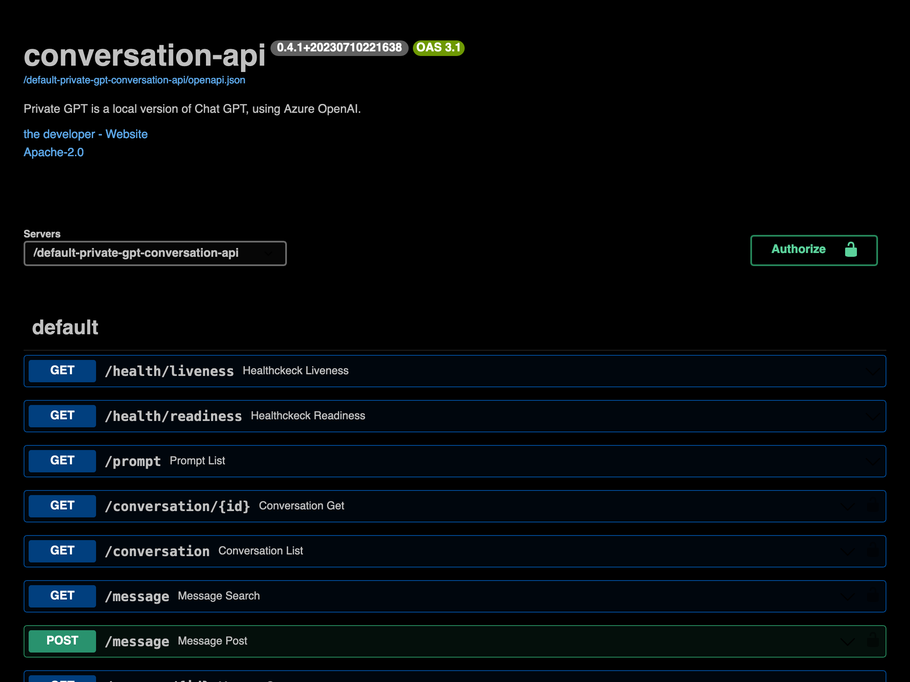
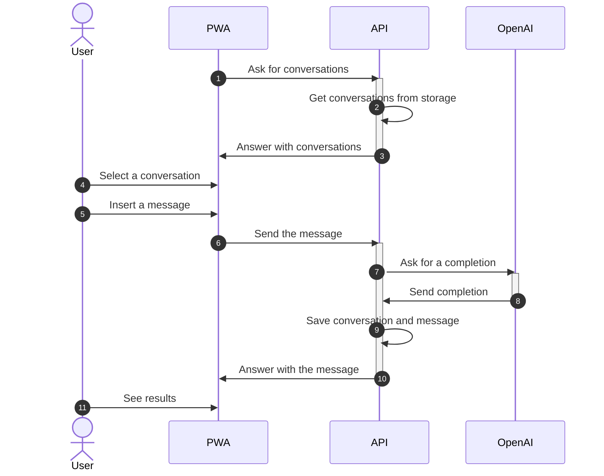

# 🔒 Private GPT

> 👋🏻 Demo available at [private-gpt.shopping-cart-devops-demo.lesne.pro](https://private-gpt.shopping-cart-devops-demo.lesne.pro).

Private GPT is a local version of Chat GPT, using Azure OpenAI. It is an enterprise grade platform to deploy a ChatGPT-like interface for your employees.

Includes:

- Can be configured to use any Azure OpenAI completion API, including GPT-4
- Dark theme for better readability
- Dead simple interface
- Deployable on any Kubernetes cluster, with its Helm chart
- Manage users effortlessly with OpenID Connect
- Monitoring with Azure App Insights (logs, traces, user behaviors)
- More than 150 tones and personalities (accountant, advisor, debater, excel sheet, instructor, logistician, etc.) to better help employees in their specific daily tasks
- Plug and play storage system, including [Azure Cosmos DB](https://learn.microsoft.com/en-us/azure/cosmos-db/), [Redis](https://github.com/redis/redis) and [Qdrant](https://github.com/qdrant/qdrant).
- Possibility to send temporary messages, for confidentiality
- Salable system based on stateless APIs, cache, progressive web app and events
- Search engine for conversations, based on semantic similarity and AI embeddings
- Unlimited conversation history and number of users
- Usage tracking, for better understanding of your employees' usage



## How to use

### Run locally

Create a local configuration file, a file named `config.toml` at the root of the project. The TOML file can be placed anywhere in the folder or in any parent directory.

```toml
# config.toml
# /!\ All the file values are for example, you must change them
[persistence]
# Enum: "qdrant"
search = "qdrant"
# Enum: "redis", "cosmos"
store = "cosmos"
# Enum: "redis"
stream = "redis"

[api]
root_path = ""

[appinsights]
connection_str = "InstrumentationKey=00000000-0000-0000-0000-000000000000;IngestionEndpoint=https://westeurope-5.in.applicationinsights.azure.com/;LiveEndpoint=https://westeurope.livediagnostics.monitor.azure.com"

[openai]
ada_deploy_id = "ada"
ada_max_tokens = 2049
api_base = "https://moaw-dev-clesne-moaw-search-oai.openai.azure.com"
gpt_deploy_id = "gpt"
gpt_max_tokens = 4096

[acs]
api_base = "https://moaw-dev-clesne-moaw-search-acs.cognitiveservices.azure.com"
api_token = "00000000000000000000000000000000"
max_length = 1000

[logging]
app_level = "DEBUG"
sys_level = "WARN"

[oidc]
algorithms = ["RS256"]
api_audience = "00000000-0000-0000-0000-000000000000"
issuers = ["https://login.microsoftonline.com/00000000-0000-0000-0000-000000000000/v2.0"]
jwks = "https://login.microsoftonline.com/common/discovery/v2.0/keys"

[qd]
host = "localhost"

[redis]
db = 0
host = "localhost"

[cosmos]
# Containers "conversation" (/user_id), "message" (/conversation_id), "user" (/dummy), "usage" (/user_id) must exist
url = "https://private-gpt.documents.azure.com:443"
database = "private-gpt"
```

Now, you can either run the application as container or with live reload. For development, it is recommended to use live reload. For demo, it is recommended to use the container.

With live reload:

```bash
# In each "src/[...]" directory, example "src/conversation-api"
make install start
```

As container:

```bash
make build start logs
```

Then, go to [http://127.0.0.1:8081](http://127.0.0.1:8081).

### Deploy locally

WIP

### Deploy in production

Deployment is container based. Use Helm to install the latest released chart:

```bash
helm repo add clemlesne-private-gpt https://clemlesne.github.io/private-gpt
helm repo update
helm upgrade --install default clemlesne-private-gpt/private-gpt
```

### Get API docs

Go to [http://127.0.0.1:8081/redoc](http://127.0.0.1:8081/redoc).



## How it works

### High level



### Architecture

WIP

## [Authors](./AUTHORS.md)
