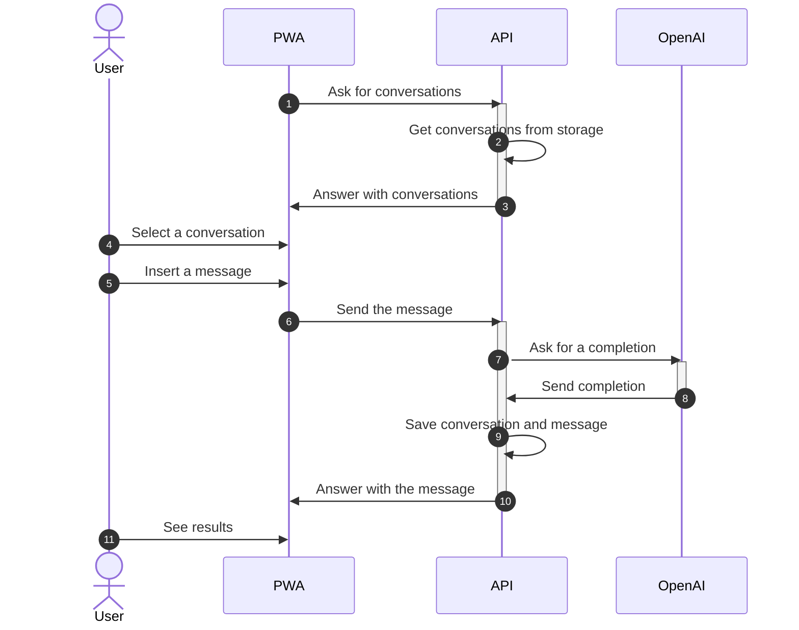

# 🔒 Private GPT

Private GPT is a local version of Chat GPT, using Azure OpenAI.


## How to use

### Run locally

Create a local configuration file, a file named `.env` at the root of the project:

```.env
# Logging
# Can be: NOTSET, DEBUG, INFO, WARN, ERROR, FATAL, CRITICAL
PG_LOGGING_APP_LEVEL=DEBUG
PG_LOGGING_SYS_LEVEL=INFO

# Authentication with OpenID Connect
# Here, example with Azure Active Directory
PG_OIDC_ALGORITHMS=RS256
PG_OIDC_API_AUDIENCE=[aad_app_id]
PG_OIDC_AUTHORITY=https://login.microsoftonline.com/[azure_tenant_id]
PG_OIDC_JWKS=https://login.microsoftonline.com/common/discovery/v2.0/keys

# Azure Cognitive Services
PG_ACS_API_BASE=https://[resource_name].cognitiveservices.azure.com
PG_ACS_API_TOKEN=[service_token]
PG_OAI_ADA_DEPLOY_ID=ada
PG_OAI_GPT_DEPLOY_ID=gpt
OPENAI_API_BASE=https://[resource_name].openai.azure.com

# Qdrant
PG_QD_HOST=localhost

# Redis
PG_REDIS_DB=0
PG_REDIS_HOST=localhost

# Azure SDK
# Here, example with a service principal with a client secret
# See: https://learn.microsoft.com/en-us/python/api/azure-identity/azure.identity.environmentcredential?view=azure-python
AZURE_AUTHORITY_HOST=https://login.microsoftonline.com
AZURE_CLIENT_ID=[client_id]
AZURE_CLIENT_SECRET=[client_secret]
AZURE_TENANT_ID=[tenant_id]
```

This will build locally the containers, start them, and display the logs:

```bash
make build start logs
```

Then, go to [http://127.0.0.1:8081](http://127.0.0.1:8081).

### Deploy locally

WIP

### Deploy in production

Deployment is container based. Use Helm to install the latest released chart:

```bash
helm repo add clemlesne-private-gpt https://clemlesne.github.io/private-gpt
helm repo update
helm upgrade --install default clemlesne-private-gpt/private-gpt
```

### Get API docs

Go to [http://127.0.0.1:8081/redoc](http://127.0.0.1:8081/redoc).


## How it works

### High level



### Architecture

WIP

## [Authors](./AUTHORS.md)
