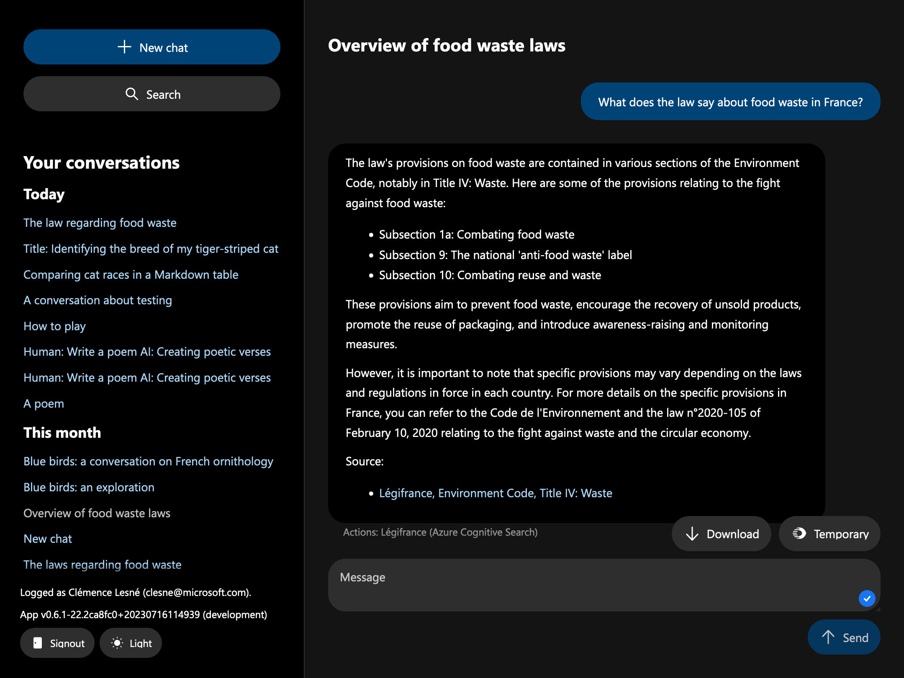
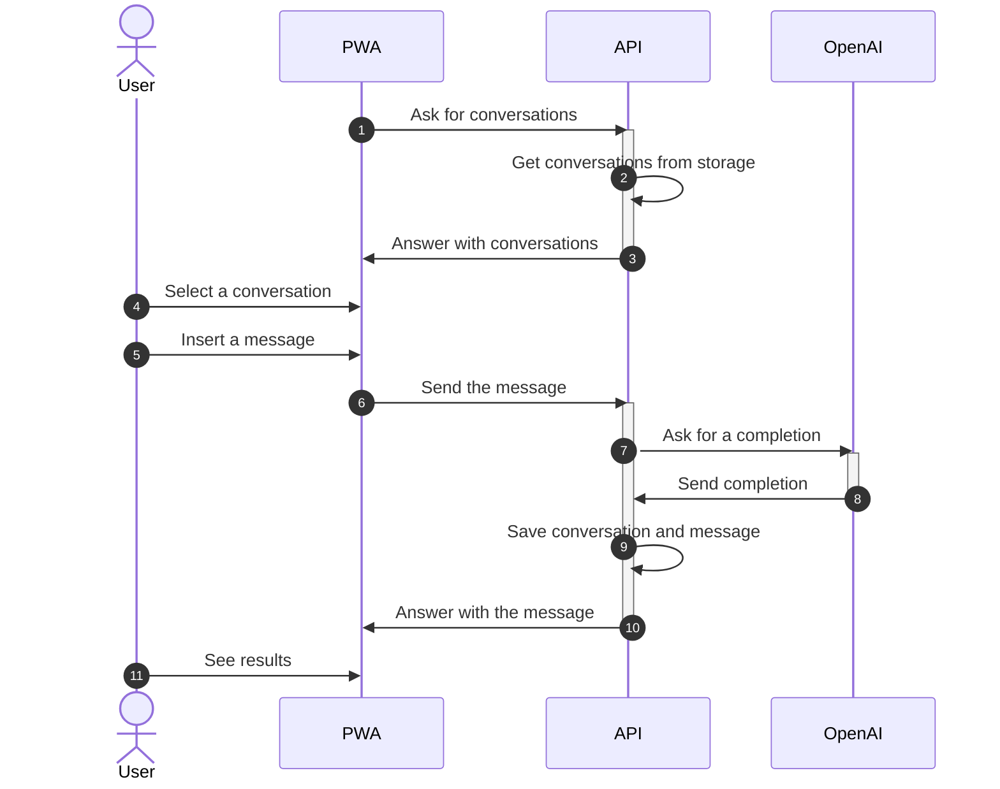
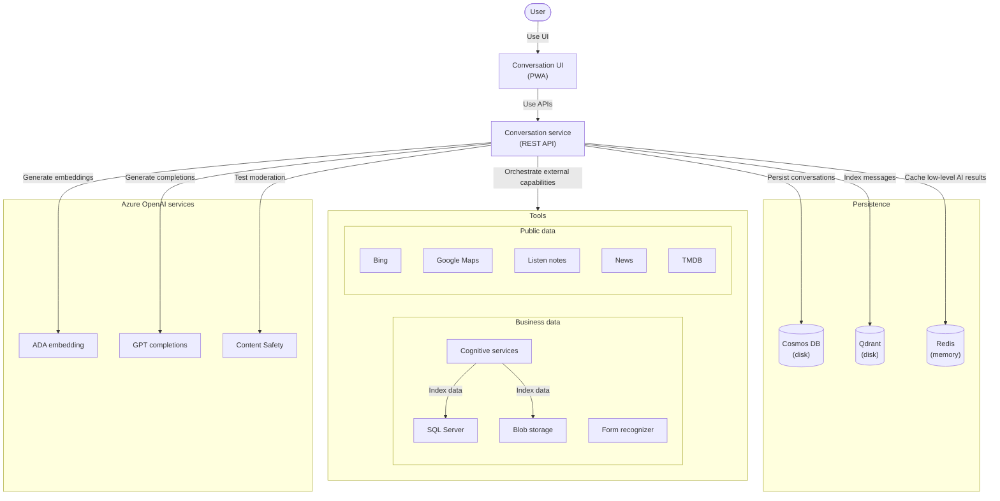
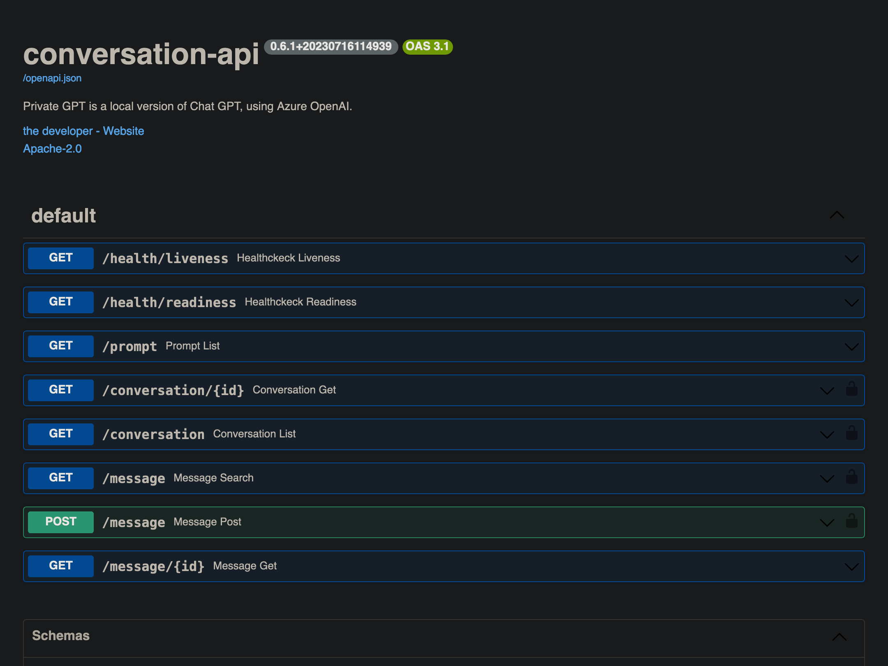

# Employee communication with Private GPT – AI-powered chatbot you can trust

> 👋🏻 Demo available at [private-gpt.shopping-cart-devops-demo.lesne.pro](https://private-gpt.shopping-cart-devops-demo.lesne.pro).

<!-- Use absolute path for images in README.md, so that they are displayed on ArtifactHub.io, Lens, OpenLens, etc. -->


Private GPT is a local version of Chat GPT, using Azure OpenAI. It is an enterprise grade platform to deploy a ChatGPT-like interface for your employees.

Includes:

- Can be configured to use any Azure OpenAI completion API, including GPT-4
- Dark theme for better readability
- Dead simple interface
- Deployable on any Kubernetes cluster, with its Helm chart
- Every persistence layers (search, index, AI) is cached, for performance and low cost
- Manage users effortlessly with OpenID Connect
- Monitoring with Azure App Insights (logs, traces, user behaviors)
- More than 150 tones and personalities (accountant, advisor, debater, excel sheet, instructor, logistician, etc.) to better help employees in their specific daily tasks
- Plug and play storage system, including [Azure Cosmos DB](https://learn.microsoft.com/en-us/azure/cosmos-db/), [Redis](https://github.com/redis/redis) and [Qdrant](https://github.com/qdrant/qdrant).
- Possibility to send temporary messages, for confidentiality
- Salable system based on stateless APIs, cache, progressive web app and events
- Search engine for conversations, based on semantic similarity and AI embeddings
- Unlimited conversation history and number of users
- Usage tracking, for better understanding of your employees' usage



## How it works

### High level



### Architecture



## How to use

### Run locally

Create a local configuration file, a file named `config.yaml` at the root of the project. The TOML file can be placed anywhere in the folder or in any parent directory.

```yaml
# config.yaml
# /!\ All the file values are for example, you must change them
api: {}
    # root_path: API_PATH

oidc:
    algorithms: ["RS256"]
    api_audience: XXX # Your Azure AD application ID
    issuers:
        [
            "https://login.microsoftonline.com/XXX/v2.0", # Your Azure AD tenant
            "https://login.microsoftonline.com/72f988bf-86f1-41af-91ab-2d7cd011db47/v2.0", # Microsoft tenant-owned applications
            "https://login.microsoftonline.com/9188040d-6c67-4c5b-b112-36a304b66dad/v2.0", # Xbox, Outlook, etc
        ]
    jwks: https://login.microsoftonline.com/common/discovery/v2.0/keys

monitoring:
    logging:
        app_level: DEBUG
        sys_level: WARN
    azure_app_insights:
        connection_str: InstrumentationKey=XXX;IngestionEndpoint=https://westeurope-5.in.applicationinsights.azure.com/;LiveEndpoint=https://westeurope.livediagnostics.monitor.azure.com

persistence:
    cache:
        type: redis
        config:
            host: localhost
    search:
        type: qdrant
        config:
            host: localhost
    store:
        type: cosmos
        config:
            url: https://private-gpt.documents.azure.com:443
            database: private-gpt
    stream:
        type: redis
        config:
            host: localhost

ai:
    openai:
        ada_deployment: ada
        ada_max_input_tokens: 8191
        ada_model: text-embedding-ada-002
        endpoint: https://private-gpt-llumwf-openai.openai.azure.com/
        gpt_deployment: gpt
        gpt_max_input_tokens: 32768
        gpt_model: gpt-4-32k
    azure_content_safety:
        api_base: https://moaw-dev-clesne-moaw-search-acs.cognitiveservices.azure.com
        api_token: XXX
        max_input_str: 1000

tools:
    azure_form_recognizer:
        api_base: https://private-gpt.cognitiveservices.azure.com
        api_token: XXX
    bing:
        search_url: https://api.bing.microsoft.com/v7.0/search
        subscription_key: XXX
    tmdb:
        bearer_token: XXX
    news:
        api_key: XXX
    listen_notes:
        api_key: XXX
    open_weather_map:
        api_key: XXX
    google_places:
        api_key: XXX
    azure_cognitive_search:
        - api_key: XXX
            displayed_name: Légifrance
            index_name: legifrance-xml
            language: fr-FR
            semantic_configuration: default
            service_name: samples-v2
            top_k: 10
            usage: Useful when you need legal content contained in one of the codes (incl. civil, commercial, labor, electoral) derived from French legislation. Use this in priority for France legal related data.
    openapi:
      - displayed_name: Jours fériés (gouv.fr)
        schema_yaml_url: https://calendrier.api.gouv.fr/jours-feries/openapi.yml
        usage: Privilege this data source for all public holidays informations in France. Data is comming from French governement.
```

Now, you can either run the application as container or with live reload. For development, it is recommended to use live reload. For demo, it is recommended to use the container.

With live reload:

```bash
# In each "src/[...]" directory, example "src/conversation-api"
make install start
```

As container:

```bash
make build start logs
```

Then, go to [http://127.0.0.1:8081](http://127.0.0.1:8081).

### Deploy locally

WIP

### Deploy in production

Deployment is container based. Use Helm to install the latest released chart:

```bash
helm repo add clemlesne-private-gpt https://clemlesne.github.io/private-gpt
helm repo update
helm upgrade --install default clemlesne-private-gpt/private-gpt
```

### Get API docs

Go to [http://127.0.0.1:8081/redoc](http://127.0.0.1:8081/redoc).



## [Security](./SECURITY.md)

## Support

This project is open source and maintained by people like you. If you need help or found a bug, please feel free to open an issue on the [clemlesne/private-gpt](https://github.com/clemlesne/private-gpt) GitHub project.

## [Code of conduct](./CODE_OF_CONDUCT.md)

## [Authors](./AUTHORS.md)
